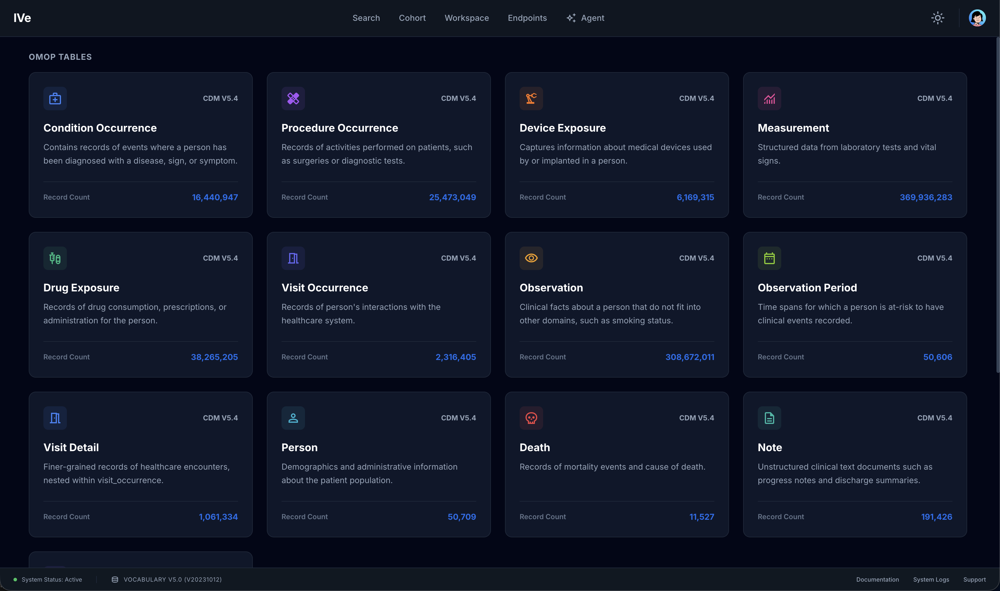

# 6. Clinical Tables Overview

## Purpose

A directory of every OMOP table available to the user. Each card shows the table name, a short description, and the live row count. Click a card to open its detail view.

## What the user sees



* **"OMOP Tables" section** — cards for the \~23 OMOP tables (person, visit\_occurrence, condition\_occurrence, drug\_exposure, measurement, observation, procedure\_occurrence, death, observation\_period, note, note\_nlp, visit\_detail, device\_exposure, cohort, cohort\_definition, etc.).
* **"Media" section** — cards for non-tabular sources (waveform, DICOM).
* **Row count badge** on each card. Loaded lazily, with a small loading state.

## Backend calls

For each card, on mount:

```
GET /api/omop/<table>/count
```

(Media cards skip the count call.)

## Redux state

`ive.tableCounts` — keyed by table name, populated as counts come back. Survives navigation so re-entering the page is instant.

## Click behaviour

| Card           | Destination                                       |
| -------------- | ------------------------------------------------- |
| Any OMOP table | [Clinical Table Detail](clinical-table-detail.md) |
| Waveform       | [Waveform Viewer](waveform.md)                    |
| DICOM          | [DICOM Viewer](dicom.md)                          |

The dispatcher lives in `routes.tsx` (`TableDetailRoute` component).
