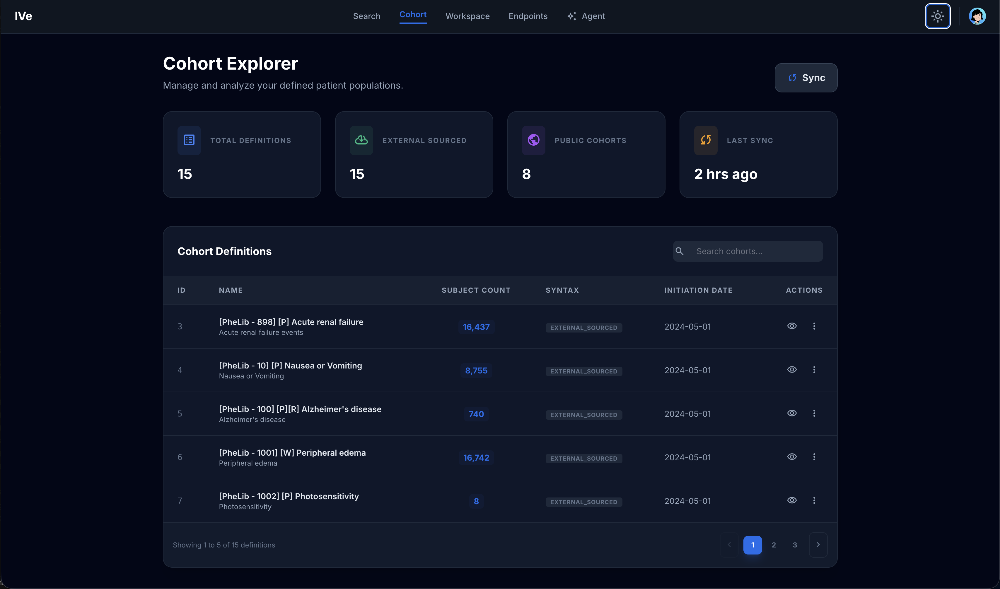
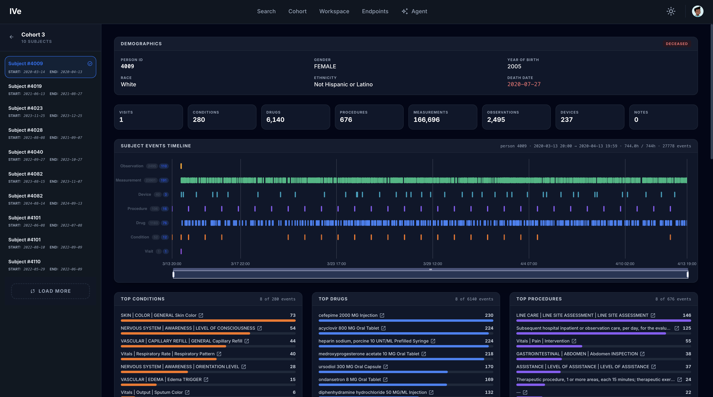
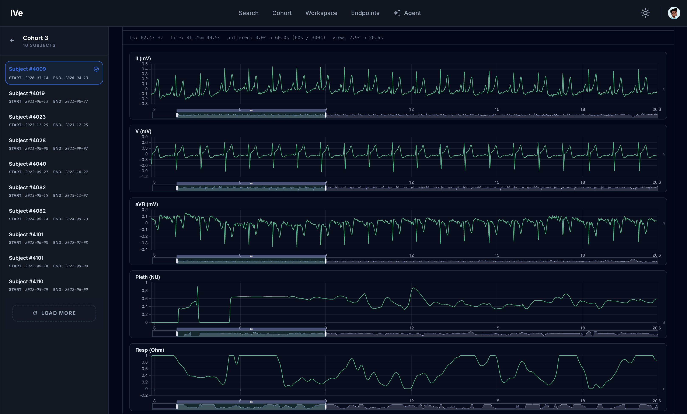

# Cohort

### Layout

* **Stat cards** — total definitions, externally sourced, public, last sync timestamp.
* **Toolbar** — search box (filters by name / description / cohort ID) + Sync button.
* **Grid of cohort rows** — name, description, subject count, syntax type (e.g. JSON, SQL).
* **Pagination** — 5 / 10 / 25 / 50 per page.

### Action: click a row

Opens that cohort's detail view.

### Action: Sync

Refreshes the cohort definitions from the external source. (Currently the list is loaded from a static seed of \~17 definitions; the Sync button is wired for the eventual remote-pull.)

## Detail view

### Layout

* **Back button** — returns to the list.
* **Left sidebar** — list of subjects in the cohort. Each button shows the person ID and the cohort start / end dates.
* **Right panel** — `CohortSubjectView` for the selected subject (person ID, cohort window).

The right panel renders whichever layout is selected for the subject view (see the [Layouts](layouts.md) guide) — by default the built-in "Subject Event Timeline" layout: demographics, per-domain record counts, a scrollable multi-track event timeline (Observation/Measurement/Device/Procedure/Drug/Condition/Visit), and top-concepts panels. A layout built from waveform-capable widgets can also surface a multi-channel signal viewer here (see [Waveform Viewer](waveform.md)):

### Notes

The current implementation reads subjects from a static `COHORT_SUBJECT_DATA` map for demo purposes. Hooking it up to a real `/api/omop/cohort_subject` endpoint is a follow-up.
