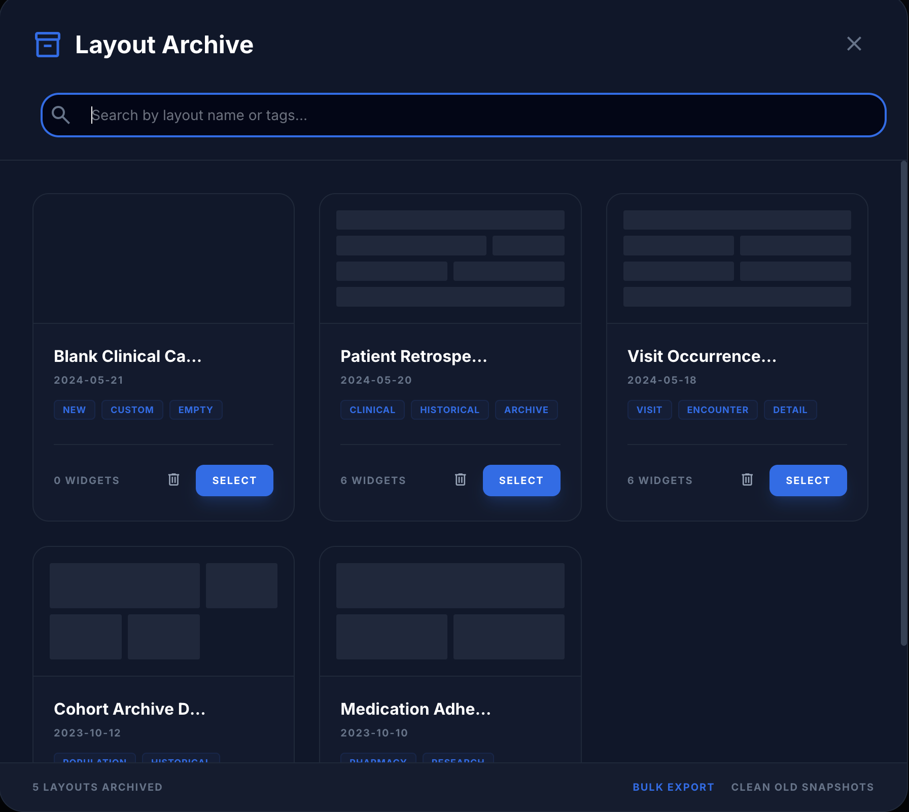

# Layouts

How dashboard layouts are stored, edited, and hosted on pages. All paths
are relative to `client/src/apps/ive/`. For building the widgets that
layouts contain, see the [Widgets](widgets.md) guide.

## What a layout is

```ts
// types.ts
interface DashboardLayout {
  id: string;
  name: string;
  tags: string[];               // iveTag slugs (user-editable labels)
  date: string;
  widgets: WidgetConfig[];
}

interface WidgetConfig {
  id: string;                   // unique within the layout, e.g. 'ge-timeline'
  type: WidgetType;             // registry key
  title: string;
  w: number;                    // grid column span, 1–12
  h?: 'auto' | 'sm' | 'md' | 'lg';
  config?: { … };               // widget-specific config (see the Widgets guide)
}
```

A layout is pure data — no components. Rendering happens wherever a page
feeds `layout.widgets` into `RegistryWidget` / `WidgetGrid`.

## Storage & loading

- **Server:** CRUD via `api/layouts.ts` → `/api/ive/layout`
  (`listLayouts`, `createLayout`, …). Widgets are stored in the layout's
  `config` column; tags via the `iveTag` join.
- **Built-in defaults:** `DEFAULT_LAYOUTS` in `store/index.ts`
  (Blank Canvas, Patient View, **Subject Event Timeline** =
  `SUBJECT_EVENT_TIMELINE_WIDGETS`, id `l-subject-event-timeline`, and
  **Subject Sepsis Review** = `SUBJECT_SEPSIS_WIDGETS`, id
  `l-subject-sepsis`: demographics + episode timeline + six
  `measurement_trend` tiles (lactate, WBC, temperature, MAP, creatinine,
  platelets) + drug/infection top-concepts + recent labs).
- **Loading:** `hooks/useLayouts.ts` → `useSavedLayouts()` returns layouts
  from Redux (`s.ive.savedLayouts`) and refreshes from the server on
  mount, appending any built-in defaults missing from the server. Use this
  hook in any page that needs layouts.

Archived layouts are restored from the Layout Archive modal (`BrowseArchiveModal`), searchable by
name or tag:



## Editing: the Workspace

`pages/Workspace.tsx` is the layout editor: add widgets from the picker
(`WidgetCreatorModal`, registry-driven), drag to reorder, edit per-widget
settings (`WidgetSettingsModal`, reads `Settings`/`defaults`/`validate`
from the registry), save via `SaveLayoutModal` → server. Saved layouts
appear everywhere layouts are listed — including page-level hosts like the
subject view — with no extra wiring. See the [Workspace](workspace.md)
page doc for the user-facing view of this.

## Hosting a layout on a page

Pages outside the Workspace render layouts read-only with `WidgetGrid`:

```tsx
<WidgetGrid
  widgets={layout.widgets}
  overrides={{ personId, startDate, endDate }}   // page context
/>
```

`overrides` is the key mechanism: it merges **last** into every widget's
config (`defaults → saved config → overrides`), so the page's context
(e.g. the selected subject) beats whatever is saved in the layout. The
same layout therefore works statically in the Workspace and dynamically on
a context page, with no duplication.

### Reference implementation: cohort subject view

`components/CohortSubjectView.tsx` (cohort page → subject detail):

- Renders the selected layout via `WidgetGrid` with
  `overrides={{ personId, startDate, endDate }}` from the selected subject.
- **Layout dropdown** lists compatible layouts. Compatibility is
  structural, via the registry — not tags:

  ```ts
  layout.widgets.length > 0 &&
  layout.widgets.every((w) => getWidget(w.type)?.category === 'person')
  ```

  i.e. every widget must accept the subject override. Mixed layouts are
  excluded rather than rendered half-broken.
- Selection persists in `localStorage` key `ive.subjectView.layoutId`;
  default is `l-subject-event-timeline`.
- To customize the subject page: build a layout in the Workspace using
  only person-scoped widgets, save it — it appears in the dropdown
  automatically.

### Recipe for a new layout host

1. `const layouts = useSavedLayouts()`.
2. Filter by a structural rule on `getWidget(w.type)` (category, or a
   future capability flag) — never by tag.
3. Keep a selected-layout id in state; persist under a page-specific
   `localStorage` key; fall back to a sensible default id.
4. Render `<WidgetGrid widgets={…} overrides={…page context…} />`.
5. Keep the page read-only; direct users to the Workspace to edit.

## Notes & future ideas

- Widgets with an explicit `personId` in saved config still work
  standalone in the Workspace; a hosting page's override only applies in
  that page's context.
- The `waveform` widget is `category: 'person'` but does not yet follow
  the subject (no person→WFDB-record mapping); it shows its configured
  record for every subject.
- Possible next step: layout-level parameters (e.g. one `personId` for
  the whole layout, widgets inherit with per-widget override) so changing
  the subject of a saved layout is one edit instead of N.
