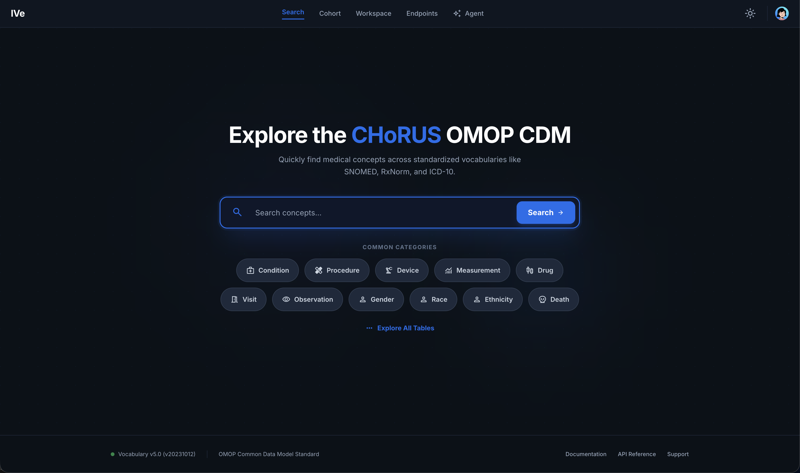

# Search (Landing)

## What the user sees

* **Hero search bar.** Single input, debounced \~400 ms.
* **Results dropdown.** Top 20 concept matches; each shows concept ID, term, occurrence count, and domain badge (Condition, Drug, Measurement, etc.).
* **Category shortcuts.** Quick pivot tiles for common domains.
* **"Explore all tables" button.** Bypass search → go to the [Clinical Tables Overview](clinical-tables.md).

## Backend calls

| When                       | Endpoint                                    |
| -------------------------- | ------------------------------------------- |
| Typing in the search box   | `GET /api/vocab/concept/search?name=<term>` |
| Click "Explore all tables" | navigates to the table overview (no call)   |

## Behaviour on selecting a result

Selecting a concept navigates to the relevant [Clinical Tables](clinical-tables.md) detail view with the chosen concept pre-applied as a filter. The destination table is inferred from the concept's domain (e.g. Condition → `condition_occurrence`).

## Related components

* `SearchConcept` — the reusable concept-search input (used here and inside the table filter modal).
