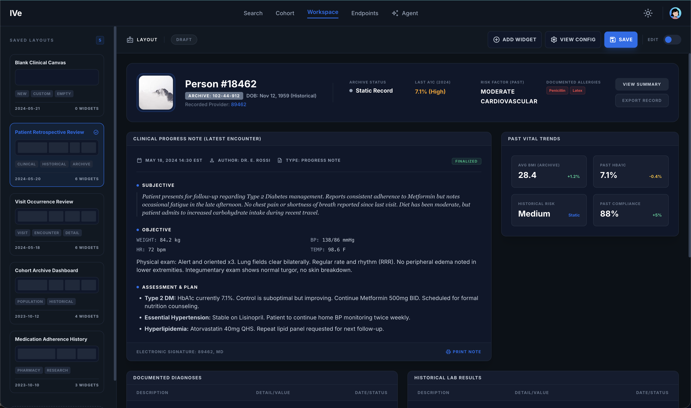
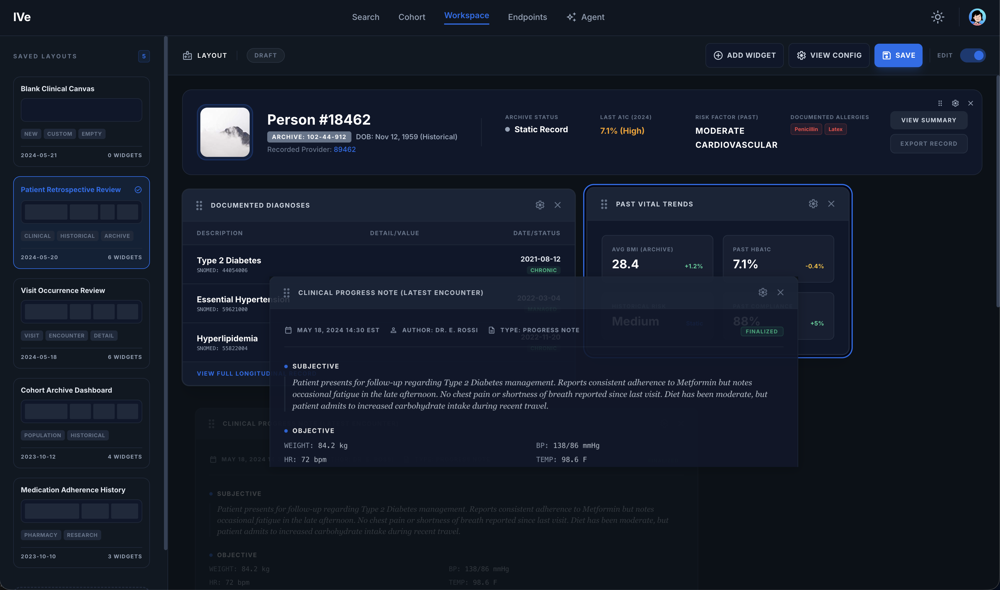

# Workspace

## Purpose

A customisable dashboard for IVe. Users build a layout out of widgets (patient profile, condition timeline, lab measurements, charts, etc.), save the layout, and revisit it later.

## What the user sees

- **Widget grid.** Drag-and-drop tiles. Edit mode toggles the drag handles.
- **Top toolbar** — Edit / Done, Save layout, Load layout, Add widget, Browse archive.
- **Sidebar** (`LayoutsSidebar`) — the user's saved layouts.

In edit mode, each widget gets drag/settings/remove controls in its title bar, and clicking a widget's settings icon opens it in place for editing:

## Widget types (rendered by the widget registry)

`patient_profile`, `clinical_note`, `conditions`, `timeline`, `stats`, `table_card`, `chart`, `radar`, `adherence`, `genericChart`, `domain_table`, `visit_header`, `omop_domain_table`.

## Modals

- `SaveLayoutModal` — name + description for a new layout.
- `WidgetSettingsModal` — per-widget config (e.g. table key, person filter, chart options).
- `WidgetCreatorModal` — pick a widget type to add; see it in the [Widgets](widgets.md) guide.
- `BrowseArchiveModal` — restore an archived layout; see it in the [Layouts](layouts.md) guide.

## Redux state (`ive` slice)

| Field | Use |
| --- | --- |
| `currentWidgets` | Widgets shown in the active layout |
| `savedLayouts` | All layouts owned by the user |
| `activeLayoutId` | Which saved layout is currently rendered |

## Backend calls

| When | Endpoint |
| --- | --- |
| Page load | `GET /api/layouts` |
| Save layout | `POST /api/layouts` |
| Update layout | `PUT /api/layouts/:id` |
| Delete layout | `DELETE /api/layouts/:id` |

Widget-specific data calls are made by each widget (see the [Person](person.md) / [Visit](visit.md) page docs for examples).

For how layouts and widgets fit together, see the [Layouts](layouts.md) and [Widgets](widgets.md) developer guides.
