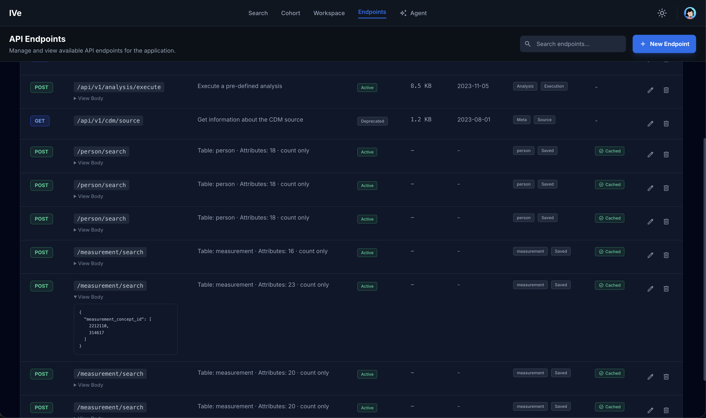

# Page 4 — Endpoints

**Route:** `/ive/endpoints`
**Source:** `client/src/apps/ive/pages/Endpoints.tsx`

## Purpose

Catalogue of saved OMOP queries. When a user composes a filter on a clinical table (see the [Clinical Table Detail](clinical-table-detail.md) page) and clicks "Save Filter", it is persisted as an *endpoint* — URL + params + tags + description. This page lists every endpoint the user can see.

## What the user sees

- **Tabs:** All / By Me / Cached.
- **DataGrid** with columns: method (GET/POST badge), path, description, tags, owner avatar, public flag, created date, cached flag.
- **Row actions:** Edit, Delete.
- **Search** field to filter by path / description / tag.

## Editing

Clicking Edit opens `SaveEndpointModal`. Fields: endpoint URL, method, description, tags (multi-select), default attributes, visibility (public / private), caching enabled.

## Backend calls

| Action | Endpoint |
| --- | --- |
| Tab "All" / "Cached" | `GET /api/ive/endpoints/visible` |
| Tab "By Me" | `GET /api/ive/endpoints/by-user/:uid` |
| Filter by tag | `GET /api/ive/endpoints/tag/:slug` |
| Edit | `PUT /api/ive/endpoints/:id` |
| Delete | `DELETE /api/ive/endpoints/:id` |

## Redux state

`ive.endpoint` slice — owns the list, current selection, and the cached "saved" status used by the clinical table detail page ("Save Filter" only enables when the current query isn't already a saved endpoint).

## Related

- `SaveEndpointModal` (also used by `ClinicalTablesDetail.tsx`).
- `FilterChips` for visualising the params of a saved endpoint.
